<div align="center">

# Guided Unsupervised Segmentation via Cross-Model Prompting

**Sabbir Ahmed**  
B.Sc. in Computer Science and Engineering  
*Jashore University of Science and Technology, Bangladesh*  
Supervised by **Dr. A F M Shahab Uddin**, Assistant Professor, Dept. of CSE, JUST  
**May 2025**

[](https://www.python.org/downloads/)
[](https://pytorch.org/)
[](https://opensource.org/licenses/MIT)

</div>

---

## 📖 What This Work Is About

Medical image segmentation — the process of identifying and delineating structures like tumors within MRI scans — depends almost entirely on large annotated datasets. These annotations require trained radiologists and are expensive, slow, and scarce. This creates a fundamental bottleneck for the deployment of AI-driven diagnostics, particularly in low-resource clinical environments.

This project explores a different question: instead of asking *"how do we get more labels,"* what if we asked *"what can we learn from the mistakes of models that have never seen medical data at all?"*

The answer, it turns out, is something.

---

## 🧠 The Core Idea

We applied **OneFormer** — a state-of-the-art segmentation model trained on natural images (everyday objects, street scenes, indoor environments) — directly to brain MRI slices from the BraTS challenge dataset. As expected, the model failed. It labeled tumor regions as walls, food, and furniture.

<div align="center">
  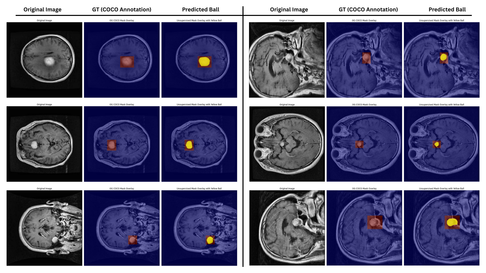
  <p><em>Figure: Grid of failed zero-shot segmentations by OneFormer.</em></p>
</div>

But buried within roughly 23,000 generated masks, across 1,500 image slices, we found 12 cases where the COCO-pretrained OneFormer had labeled the tumor region as a **"sports ball."**

<div align="center">
  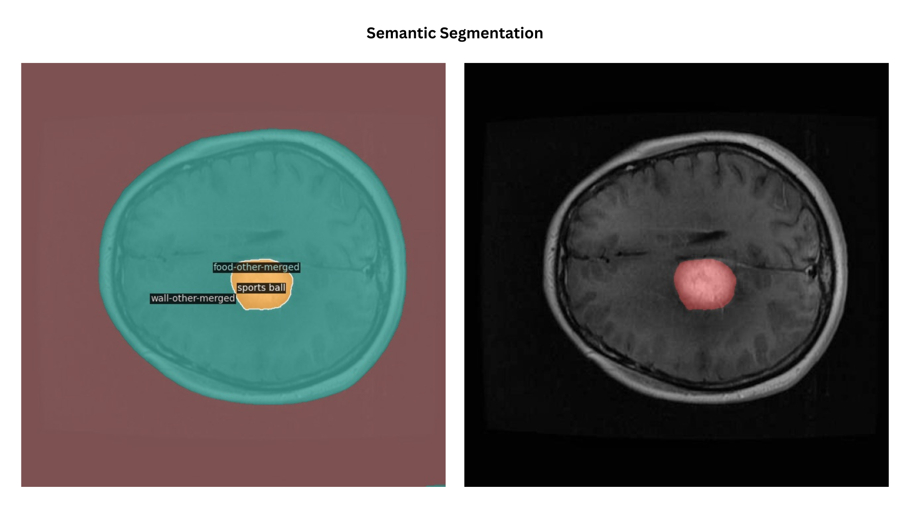
  <br/>
  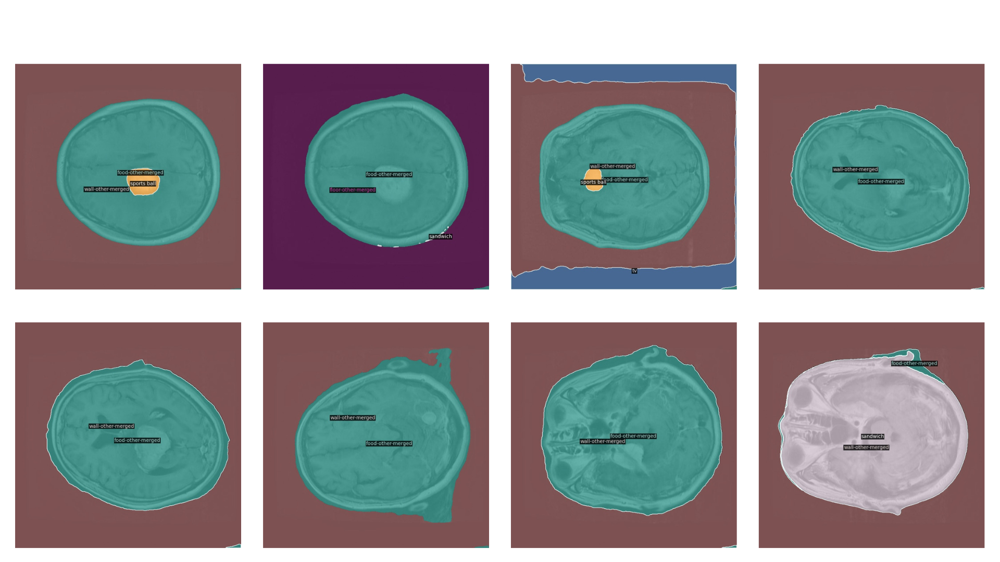
  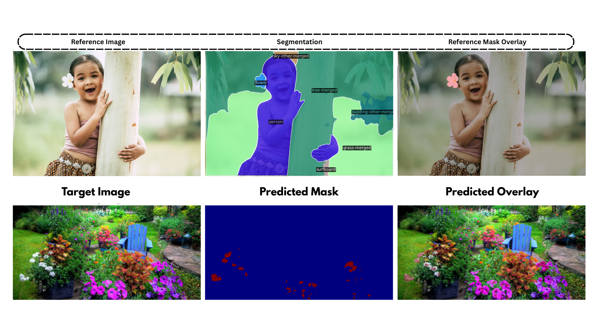
  <p><em>Figure: A semantic failure acting as a spatial success. A tumor misclassified as a "sports ball".</em></p>
</div>

This was semantically absurd. But geometrically, it made a kind of sense: brain tumors on MRI can appear as bright, roughly circular blobs — and a model trained on sports balls had apparently learned some of the same low-level shape features. The semantic label was wrong. The spatial location was right.

We then asked: **could this semantically wrong but spatially correct mask serve as a useful visual cue for a second model?**

To test this, we used **SegGPT** — a visually prompted segmentation model that segments regions in a target image based on their resemblance to a reference image-mask pair. We gave it the "sports ball" mask as a prompt and asked it to find similar regions in other BraTS slices.

<div align="center">
  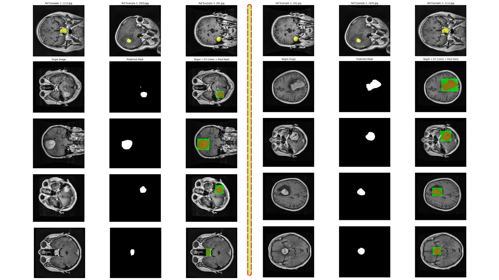
  <p><em>Figure: The SegGPT Prompting Mechanism in action.</em></p>
</div>

The results were qualitatively striking. SegGPT, guided by this unusual prompt, produced tumor segmentations that were far more coherent and spatially accurate than anything OneFormer had generated. Quantitatively, the best-performing prompt achieved a mean Dice score of 0.316 — modest by supervised benchmarks, but a substantial improvement over baseline results that were effectively zero.

---

## 🚀 Why This Matters

This study is not presenting a production-ready segmentation system. What it is presenting is a proof-of-concept for a mechanism that has not, to our knowledge, been explicitly investigated: **the deliberate repurposing of cross-domain model misclassifications as prompts for a second model.**

Most of the field treats failure outputs as noise to be discarded. This work treats a specific category of failure — rare, spatially informative misclassification — as latent signal. The implications, if the mechanism generalizes, are meaningful:

- **No target-domain annotations are required** at any stage
- **No domain adaptation training** is performed
- The pipeline runs entirely at **inference time** using pre-trained models
- The only cost is careful analysis of what generalist models get wrong

This approach could offer a pathway for leveraging the power of foundation models in specialized domains — medical imaging, satellite imagery, industrial inspection — where labeled data is genuinely scarce.

---

## 🧪 Methods Summary

### Dataset
We used the "Brain Tumor Image Dataset: Semantic Segmentation" derived from the BraTS challenge. Ground truth binary masks (tumor vs. background) were generated from the COCO annotations and used **exclusively for post-hoc evaluation** — never during model inference.

<div align="center">

| MRI Slices | Ground Truth Masks |
|:---:|:---:|
| 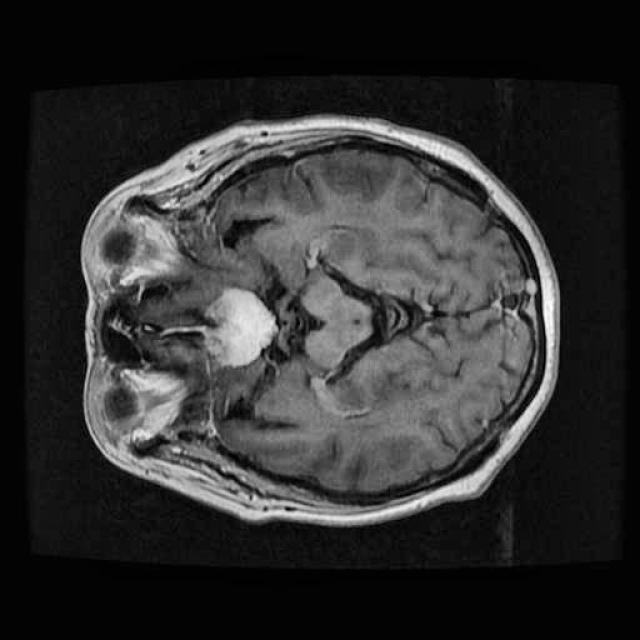 | 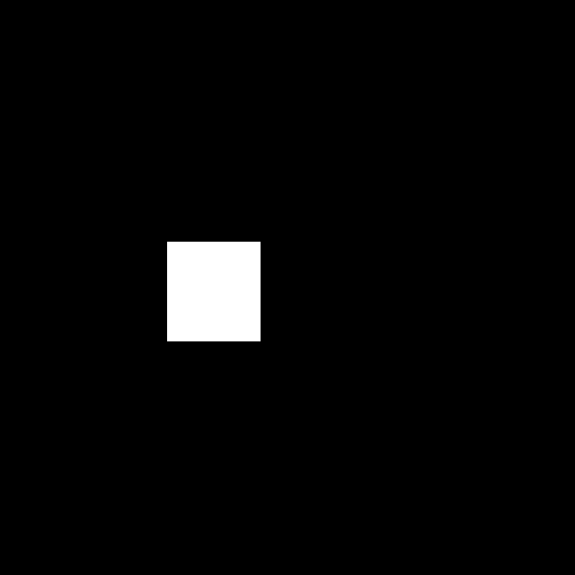 |
| 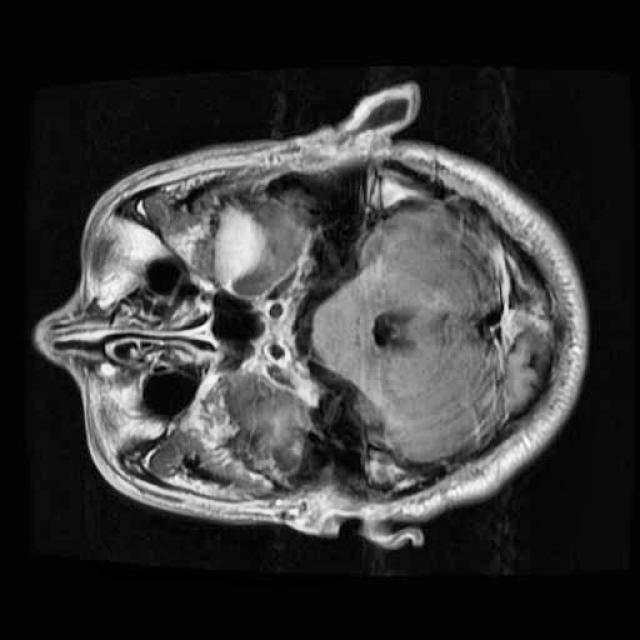 | 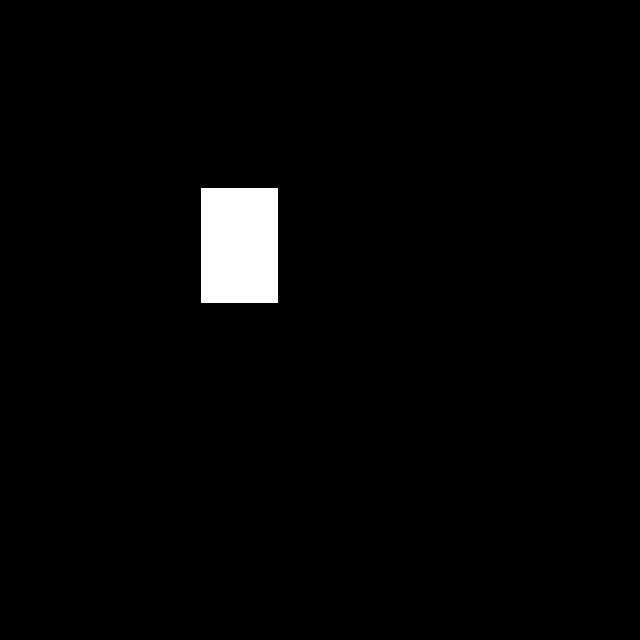 |
| 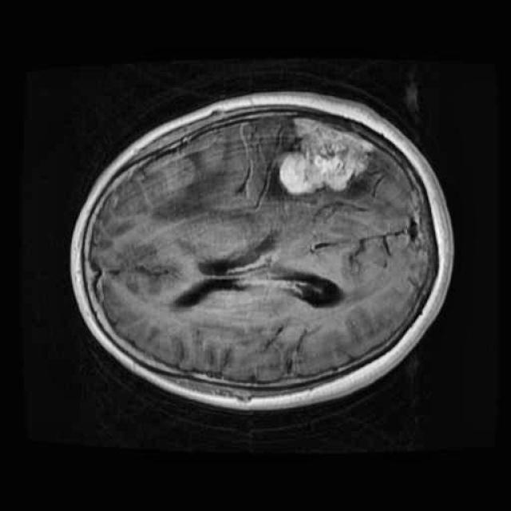 | 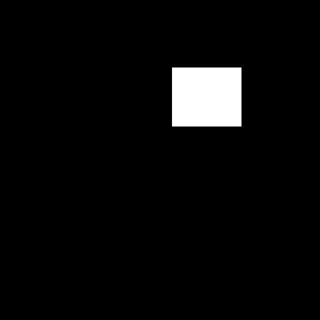 |

</div>

### Phase 1: Zero-Shot OneFormer Evaluation
Three pre-trained OneFormer checkpoints (COCO, ADE20K, Cityscapes) were applied directly to 1,500 slices. The COCO-trained model generated ~23,000 individual masks. Within these, 12 instances of the "sports ball" label were found to spatially overlap with the confirmed tumor region.

### Phase 2: Guided SegGPT Experiment
Three of these "sports ball" masks were selected as visual prompts. SegGPT identified regions in target images that resembled the prompt reference.

#### Prompt Sources: Best vs Worst Performance

<div align="center">

| | Source Image | Resulting Mask |
|:---|:---:|:---:|
| **Best Prompt** (1112) | 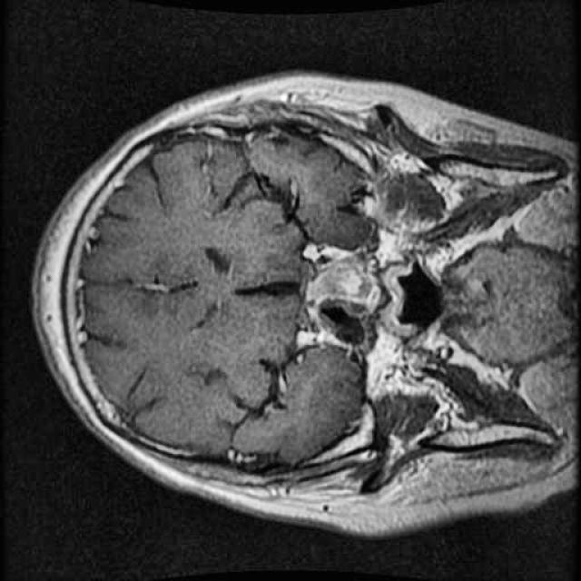 | 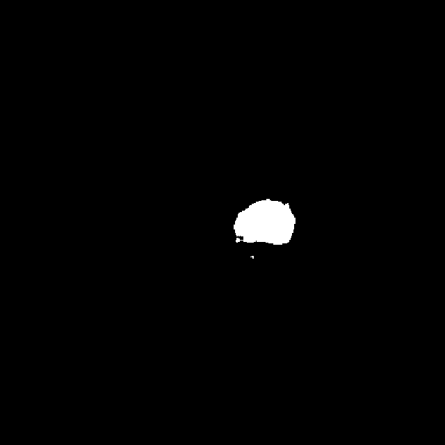 |
| **Worst Prompt** (281) | 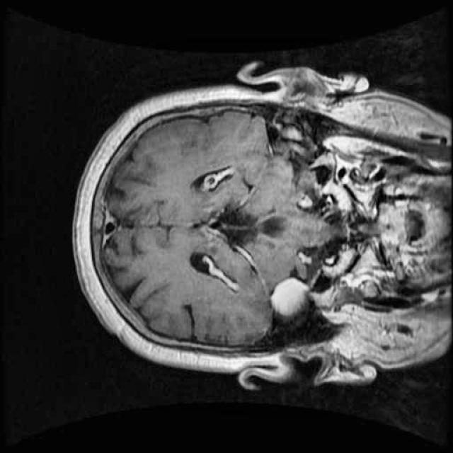 | 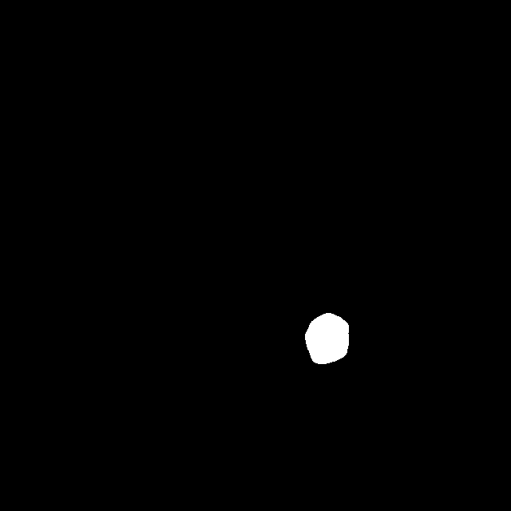 |

</div>

---

## 📊 Key Quantitative Results

The strong variation between prompts indicates that the quality and representativeness of the "weak signal" mask is the primary determinant of downstream performance.

| Prompt Source | Mean Dice | Median Dice |
|---------------|:---------:|:-----------:|
| **1112.jpg (best)** | **0.316** | **0.253** |
| 2829.jpg (mid) | — | — |
| 281.jpg (worst) | 0.120 | 0.000 |

<div align="center">
  <h4>Dice Score Distributions</h4>
  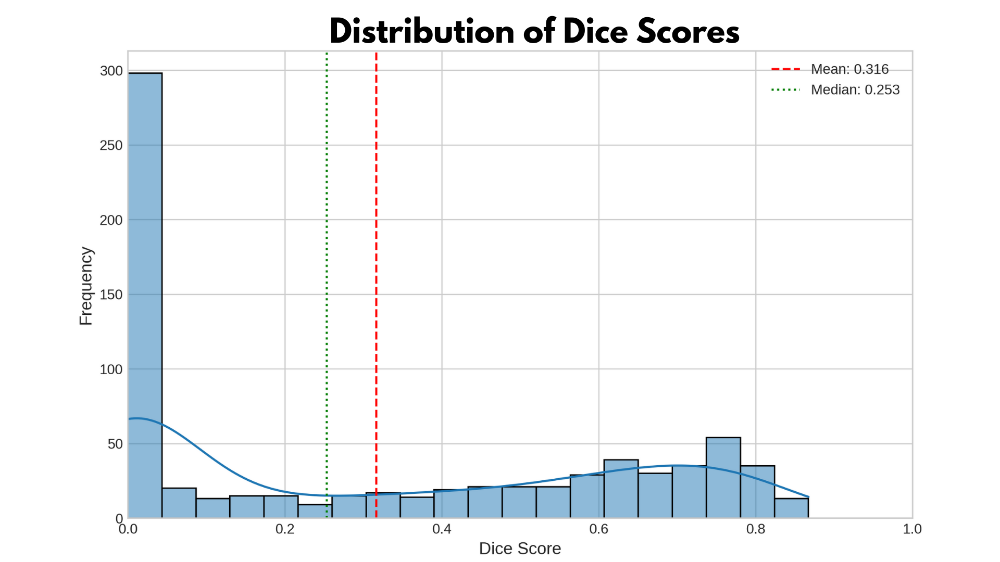
  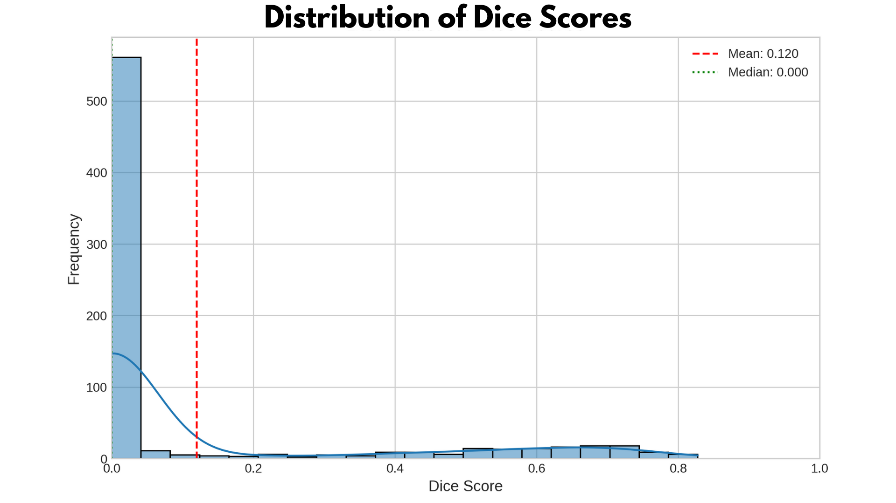
  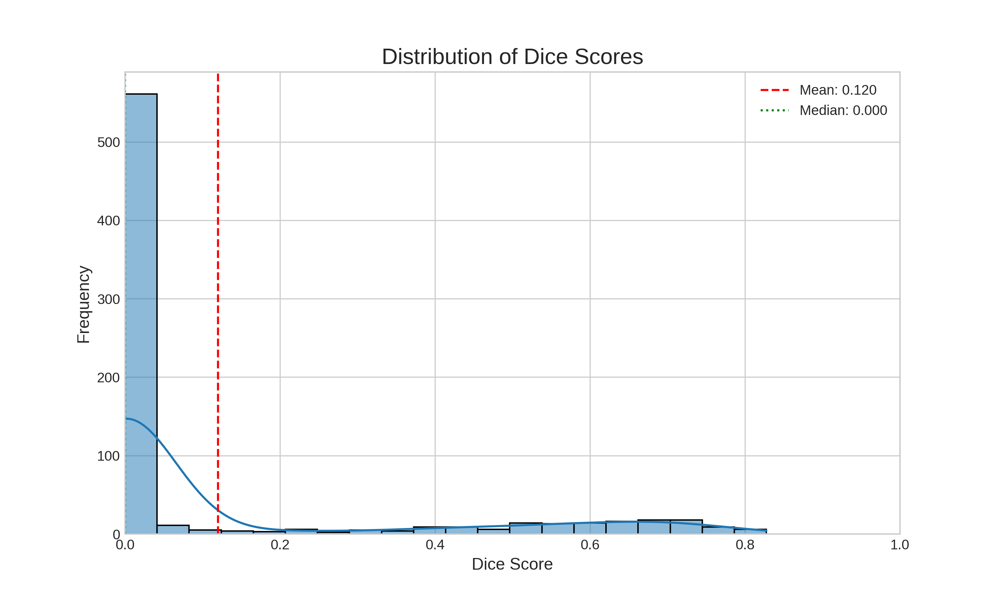
  
  <h4>IoU vs Dice Boxplots</h4>
  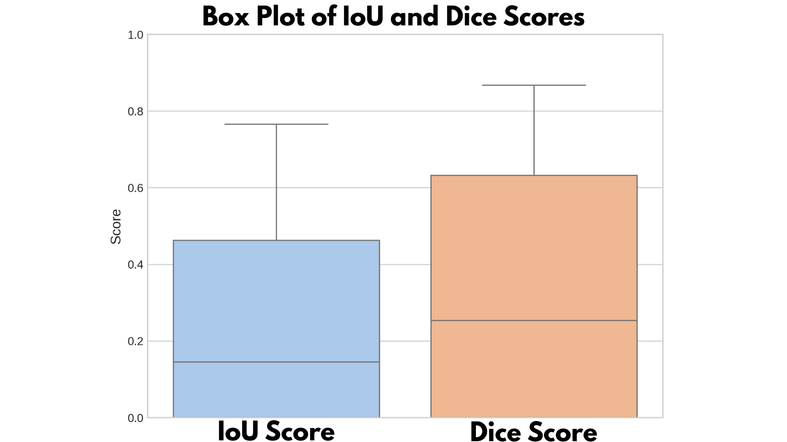
  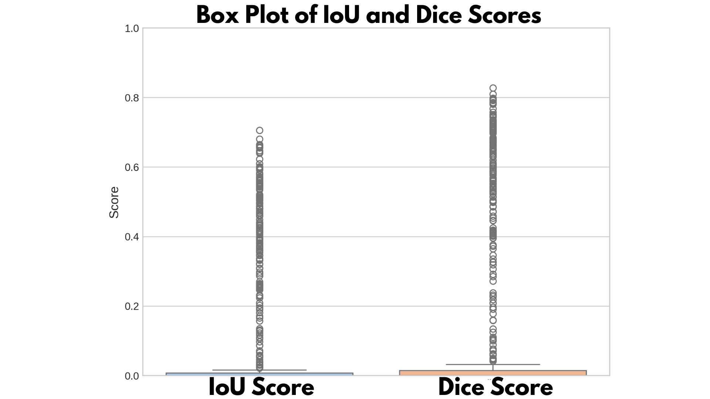
</div>

---

## 📂 Repository Structure

```text
.
├── README.md
├── Thesis_Sabbir_Ahmed.pdf         # Full B.Sc. thesis
├── Final Defense.pdf               # Presentation slides for final defense
├── requirements.txt                # Python dependencies
├── environment.yml                 # Conda environment specification
│
├── src/
│   ├── phase1_oneformer/
│   │   ├── run_inference.py        # Zero-shot OneFormer inference on BraTS
│   │   └── extract_sports_ball.py  # Identifies and saves "sports ball" masks
│   │
│   ├── phase2_seggpt/
│   │   ├── run_prompted_inference.py  # SegGPT inference using prompt masks
│   │   └── evaluate.py                # Computes Dice and IoU against GT
│   │
│   └── utils/
│       ├── preprocess_dataset.py   # Parses COCO annotations, generates GT masks
│       ├── visualize_results.py    # Generates overlay figures and plots
│       └── metrics.py              # Dice and IoU implementations
│
└── results/
    ├── figures/                    # Qualitative output and methodology figures
    │   ├── dataset/
    │   ├── oneformer_failures/
    │   ├── seggpt_qualitative/
    │   └── sports_ball_verification/
    └── quantitative/               # Plotted quantitative distributions and results
